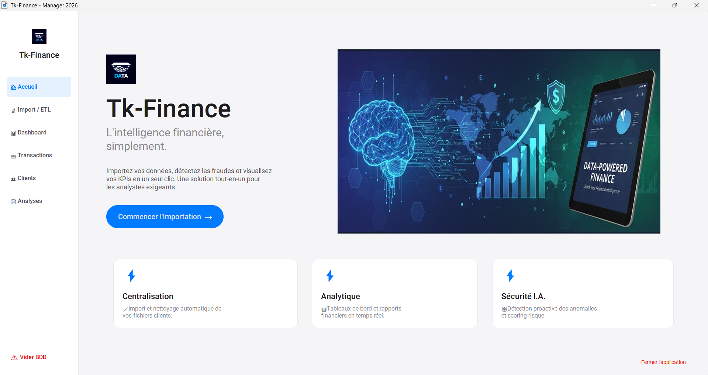
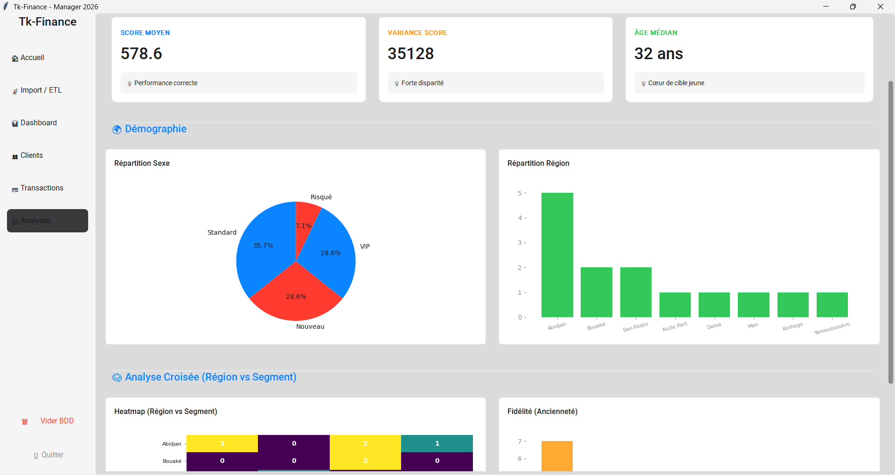

# Tk-Finance : Data Analysis and Machine Learning with Tkinter 🚀

**Data Intelligence & Financial Management System.**


Tk-Finance is a modern desktop application designed to bridge the gap between raw client data and strategic decision-making. Built with a sleek **CustomTkinter** interface, it features an ETL pipeline, AI-driven fraud detection, and real-time financial analytics.



---

## ✨ Key Features

* **🎨 Modern UI/UX:** A responsive, Apple-inspired interface with a "Zero-Scroll" dashboard.
* **📡 ETL Console:** Robust Import module capable of auditing, cleaning, and structuring messy CSV/Excel datasets.
* **🧠 AI Fraud Detection:** Integrated **Isolation Forest** algorithm (Scikit-Learn) to automatically flag suspicious client profiles.
* **📊 Interactive Dashboard:** Real-time KPIs, trend analysis, and financial visualizations.
* **💳 Transaction Ledger:** Double-entry bookkeeping system with automatic balance updates.
* **📈 Advanced Analytics:** Automatic generation of financial reports (.xlsx) and demographic heatmaps.

---

## 🛠️ Tech Stack

* **Core:** Python 3
* **GUI:** CustomTkinter (Modern Tkinter wrapper)
* **Data Processing:** Pandas, NumPy
* **Visualization:** Matplotlib
* **AI/ML:** Scikit-Learn (Isolation Forest)
* **Database:** SQLite3

---

## 🚀 Installation & Setup

1.  **Clone the repository**
    ```bash
    git clone [https://github.com/YOUR_USERNAME/tk-finance.git](https://github.com/YOUR_USERNAME/tk-finance.git)
    cd tk-finance
    ```

2.  **Create a virtual environment (Optional but recommended)**
    ```bash
    python -m venv venv
    # Windows
    venv\Scripts\activate
    # macOS/Linux
    source venv/bin/activate
    ```

3.  **Install dependencies**
    ```bash
    pip install -r requirements.txt
    ```

4.  **Run the application**
    ```bash
    python main.py
    ```

---

## 📂 Project Structure

```text
tk-finance/
├── assets/             # Images, Icons, and Banners
├── core/               # Backend Logic
│   ├── data_manager.py # SQL & Database Handler
│   ├── data_cleaner.py # ETL & Data Sanitization
│   ├── scoring_model.py# Risk Scoring Algorithm
│   ├── statistics.py   # KPI Calculation Engine
│   └── anomaly.py      # AI Fraud Detection Model
├── gui/                # Frontend (CustomTkinter)
│   ├── dashboard_view.py
│   ├── clients_view.py
│   ├── analytics_view.py
│   └── ...
├── main.py             # Application Entry Point
└── requirements.txt    # Dependencies

👥 Authors
[Njomani Fred - Demgne Skeva - Nana Zanira / Groupe 3] - Lead Developers & Architects

